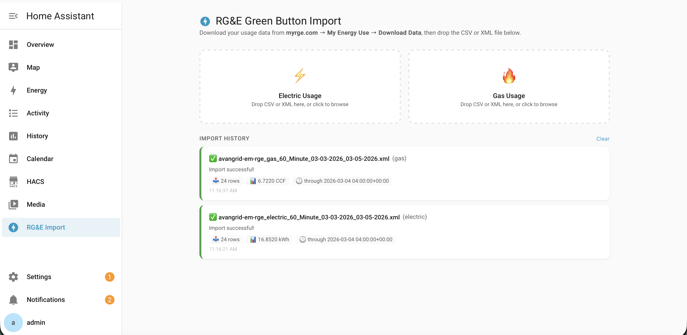
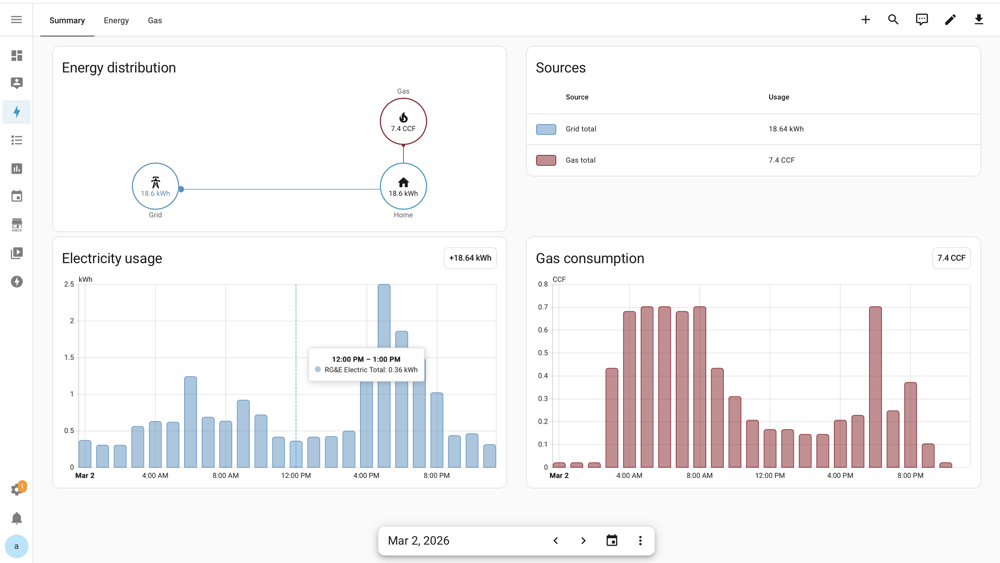

# RG&E Green Button — Home Assistant Custom Integration

[](https://www.home-assistant.io/)
[](LICENSE)

Import your **Rochester Gas & Electric (RG&E)** smart meter usage data directly into the [Home Assistant Energy Dashboard](https://www.home-assistant.io/docs/energy/) via a drag-and-drop sidebar panel. Supports both **electric** (kWh) and **gas** (CCF/therms) usage from RG&E's Green Button CSV and XML exports.



---

## Features

- ⚡ **Drag-and-drop import** — dedicated sidebar panel, no command line needed
- 📊 **Full historical backfill** — imports all hourly data with correct past timestamps into the Energy Dashboard
- 🔁 **Safe re-imports** — duplicate rows are automatically skipped; overlapping files can be re-dropped safely
- 📁 **CSV and XML support** — works with both RG&E Opower CSV exports and standard Green Button ESPI XML exports
- 🔔 **Import notifications** — persistent HA notifications confirm row counts and usage totals on success or failure
- 🔌 **No YAML configuration** — fully UI-driven setup except for one `panel_custom` entry (see below)
- 🏠 **Energy Dashboard ready** — sensors use the correct `device_class`, `state_class`, and units to appear in HA's Energy Dashboard

---

## Sensors Created

| Sensor | Entity ID | Unit | Device Class | State Class |
|--------|-----------|------|-------------|-------------|
| RG&E Electric Total | `sensor.rg_e_electric_total` | kWh | `energy` | `total_increasing` |
| RG&E Gas Total | `sensor.rg_e_gas_total` | CCF | `gas` | `total_increasing` |

Both sensors are automatically available in **Settings → Energy** for the Electricity grid and Gas consumption sections.

---

## Requirements

- Home Assistant **2025.1 or later** (tested on 2026.2)
- RG&E account with smart meter data available at [myrge.com](https://www.myrge.com)
- SSH or file access to your HA config directory (for initial install only)

---

## Installation

### Manual

1. Download or clone this repository
2. Copy the `rge_green_button` folder into your HA config directory:
   ```
   config/custom_components/rge_green_button/
   ```
3. Verify the file structure looks like this:
   ```
   custom_components/rge_green_button/
   ├── frontend/
   │   └── rge-green-button-panel.js
   ├── images/
   │   ├── icon.png
   │   └── logo.png
   ├── translations/
   │   └── en.json
   ├── __init__.py
   ├── config_flow.py
   ├── const.py
   ├── manifest.json
   ├── parser.py
   ├── sensor.py
   ├── storage.py
   └── strings.json
   ```

### HACS (coming soon)

This integration is not yet in the HACS default store. You can add it as a custom repository:

1. In HACS → Integrations → three-dot menu → **Custom repositories**
2. Add your GitHub repo URL with category **Integration**
3. Search for "RG&E Green Button" and install

---

## Configuration

### Step 1 — Register the sidebar panel

Add the following to your `configuration.yaml` (one-time only):

```yaml
panel_custom:
  - name: rge-green-button-panel
    sidebar_title: RG&E Import
    sidebar_icon: mdi:lightning-bolt-circle
    url_path: rge-green-button
    module_url: /local/rge_green_button/rge-green-button-panel.js
```

> **Why is YAML needed?** Home Assistant removed the programmatic Python API for registering sidebar panels in recent versions. The `panel_custom` entry is the only supported method, and it only needs to be added once.

### Step 2 — Restart Home Assistant

```bash
docker restart homeassistant
# or via UI: Settings → System → Restart
```

On first start the integration automatically copies the panel JavaScript file to `config/www/rge_green_button/` so it can be served by HA's built-in web server.

### Step 3 — Add the Integration

1. Go to **Settings → Devices & Services**
2. Click **+ Add Integration**
3. Search for **RG&E Green Button**
4. Click **Submit** — no additional configuration required

### Step 4 — Add Sensors to the Energy Dashboard

1. Go to **Settings → Energy**
2. Under **Electricity grid → Grid consumption** → **Add consumption** → select `RG&E Electric Total`
3. Under **Gas consumption** → **Add gas source** → select `RG&E Gas Total`
4. Click **Save**

---

## Usage

### Downloading Your Data from RG&E

1. Log in at [myrge.com](https://www.myrge.com)
2. Navigate to **My Energy Use** or **My Account → Energy Usage**
3. Select your desired date range (up to ~12 months per download)
4. Download as **CSV** or **Green Button XML**
5. Download a separate file for electric and gas if needed

> **Tip:** For initial historical backfill, download in 12-month chunks working backwards from today. Overlapping date ranges between files are handled safely.

### Importing Files

1. Open **RG&E Import** in the Home Assistant sidebar
2. Drag your electric CSV or XML onto the ⚡ **Electric Usage** zone
3. Wait for the success notification confirming the row count and usage total
4. Drag your gas CSV or XML onto the 🔥 **Gas Usage** zone
5. The Energy Dashboard will populate with historical hourly data immediately

### Weekly Workflow

RG&E updates smart meter data with a ~48 hour delay. A typical weekly routine:

1. Download the past week's CSV or XML from myrge.com
2. Drop electric file into the ⚡ zone
3. Drop gas file into the 🔥 zone
4. Done — new data appears in the Energy Dashboard

Duplicate rows from overlapping date ranges are automatically skipped, so you can always download a slightly wider range than needed without worrying about double-counting.

---

## Supported File Formats

### CSV (Opower Export)

RG&E's standard spreadsheet export. Contains both electric and gas data in a single file, with a `Type` column used to distinguish them.

| Column | Description |
|--------|-------------|
| `Start Time` | Interval start timestamp (timezone-aware ISO format) |
| `Usage` | Energy or gas usage for the interval |
| `Type` | `electric` or `gas` |

Example row:
```
2026-01-15 00:00:00-05:00,0.938,electric
```

### XML (Green Button ESPI)

The industry-standard Green Button format. RG&E provides separate XML files for electric and gas.

| Service | ServiceCategory kind | uom | Conversion |
|---------|---------------------|-----|-----------|
| Electric | `0` | `72` (Wh) | `value × 10⁻³ ÷ 1000 = kWh` |
| Gas | `1` | `169` (therms) | `value × 10⁻³ = therms` |

The parser auto-detects the service type and applies the correct unit conversion from the `ReadingType` metadata in the file.

---

## How It Works

### Architecture

```
Browser (HA Frontend)          HA Backend (Python)
─────────────────────          ───────────────────
RG&E Import Panel              WebSocket Handler
  │                              │
  │  FileReader.readAsText()     │
  │  → file content (UTF-8)      │
  │                              │
  └──── WebSocket message ──────►│
         type: rge_green_button  │
         /import_file            │
                                 │
                          Write temp file
                                 │
                          parser.py
                          (CSV or XML)
                                 │
                          ParseResult
                          (hourly_readings[])
                                 │
                          recorder.async_import_statistics()
                          (writes historical stats to DB)
                                 │
                          sensor state update
                          persistent notification
```

### Why `async_import_statistics`?

Simply updating a sensor's state only records a single data point at the current time. The Energy Dashboard reads from HA's **long-term statistics** database, which stores hourly aggregates. `async_import_statistics` writes directly into this database with the correct historical timestamps, enabling full backfill of months of hourly data in a single import.

### Duplicate Prevention

Each successful import stores the timestamp of the most recently imported reading in HA's `.storage` directory (`rge_green_button_data`). On subsequent imports, any row with a timestamp at or before this value is skipped. This means:

- Re-importing the same file is always safe
- Files with overlapping date ranges can be dropped in any order
- Gaps in downloaded data are automatically filled when you drop a file that covers them

---

## Resetting / Starting Fresh

If you need to wipe all data and start over:

1. **Delete long-term statistics** — Developer Tools → Statistics → find both RG&E sensors → delete all statistics
2. **Purge entity history** — Developer Tools → Actions:
   ```yaml
   action: recorder.purge_entities
   data:
     entity_id:
       - sensor.rg_e_electric_total
       - sensor.rg_e_gas_total
     keep_days: 0
   ```
3. **Delete integration storage:**
   ```bash
   rm /config/.storage/rge_green_button_data
   ```
4. **Restart HA**
5. **Re-import your files** — oldest date range first, then newer

---

## Troubleshooting

### "No new data found" notification

The integration's stored `last_time` is already at or past the end of your file. Either:
- Your file covers dates you've already imported — this is normal and safe
- You need to download a more recent date range from myrge.com
- If unexpected, delete `.storage/rge_green_button_data` and restart to reset

### Sensor doesn't appear in Energy Dashboard gas section

HA requires a non-zero sensor value and correct `device_class: gas` with a volume unit. Verify in **Developer Tools → States** that `sensor.rg_e_gas_total` shows `device_class: gas` and `unit_of_measurement: CCF`. If the unit shows `therms` (from an older version), go to **Developer Tools → Statistics** and update the unit to `CCF`.

### Energy Dashboard shows negative values or gaps

This happens when statistics from a previous partial import have an inconsistent cumulative sum. Fix by following the full reset procedure above, then reimport all files oldest-to-newest.

### "Connection error" when dropping a file

Check **Settings → System → Logs** and filter for `rge_green_button`. Common causes:
- Integration not fully loaded — check for setup errors in the log
- File is not valid UTF-8 — try re-downloading from myrge.com
- HA WebSocket connection dropped — refresh the browser and try again

### Integration not found in Settings → Add Integration search

The `custom_components/rge_green_button/` folder name must use **underscores** (not hyphens) and match exactly. Verify:
```bash
ls /config/custom_components/
# Should show: rge_green_button
```

### Panel JS 404 in browser console

The JS file wasn't copied to `config/www/`. Check that `config/www/rge_green_button/rge-green-button-panel.js` exists after restart. If not, verify the `frontend/` subfolder exists inside your custom component directory.

---

## Contributing

Pull requests are welcome! If you find a bug or have an improvement:

1. Fork the repository
2. Create a feature branch (`git checkout -b feature/my-improvement`)
3. Commit your changes
4. Open a pull request

If you use a different utility that also provides Green Button CSV or XML exports (National Grid, ConEd, etc.) and want to add support, please open an issue with a sample file (with personal data removed) and we can extend the parser.

---

## License

MIT License — see [LICENSE](LICENSE) for details.

---

## Acknowledgements

Built for the Home Assistant community. RG&E and Green Button are trademarks of their respective owners. This project is not affiliated with or endorsed by Avangrid, RG&E, or the Green Button Alliance.
