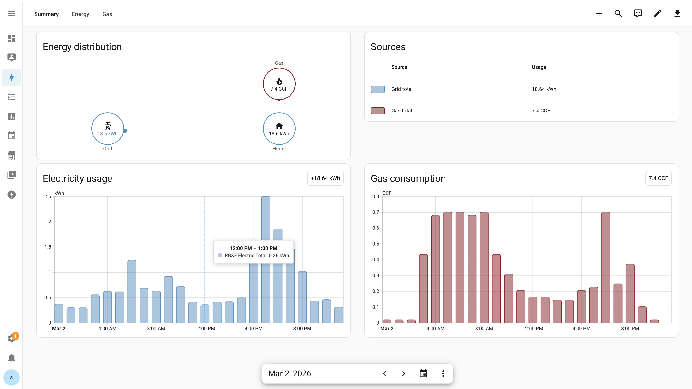
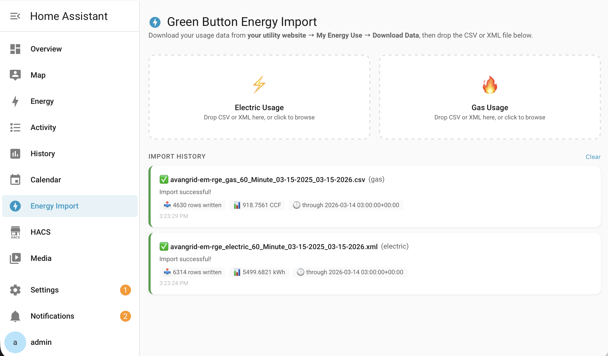

# Green Button Energy Import — Home Assistant Custom Integration

[](https://www.home-assistant.io/)
[](https://hacs.xyz)
[](https://github.com/cskolny/ha-green-button-energy/releases)
[](LICENSE)
[](https://github.com/cskolny/ha-green-button-energy/actions/workflows/lint.yml)
[](https://github.com/cskolny/ha-green-button-energy/actions/workflows/validate.yml)

Import your **Avangrid utility** smart meter usage data and monthly billing costs directly into the
[Home Assistant Energy Dashboard](https://www.home-assistant.io/docs/energy/)
via a drag-and-drop sidebar panel — or hands-free via an automatically watched folder. Supports
**electric** (kWh) and **gas** (CCF/therms) usage from Green Button CSV and XML exports, plus
**monthly billing CSV** exports for actual cost tracking.



---

## Supported Utilities

This integration works with any Avangrid utility that provides Green Button
data exports:

| Utility | State | Service |
|---------|-------|---------|
| Rochester Gas & Electric (RG&E) | New York | Electric & Gas |
| New York State Electric & Gas (NYSEG) | New York | Electric & Gas |
| Central Maine Power (CMP) | Maine | Electric |
| United Illuminating (UI) | Connecticut | Electric |
| Connecticut Natural Gas (CNG) | Connecticut | Gas |
| Southern Connecticut Gas (SCG) | Connecticut | Gas |
| Berkshire Gas | Massachusetts | Gas |

---

## Features

- ⚡ **Drag-and-drop import** — dedicated sidebar panel, no command line needed
- 📂 **Automatic folder import** — drop files into a watched folder on disk and they're imported automatically within 60 seconds, no browser session required
- 📊 **Full historical backfill** — imports all hourly data with correct past timestamps into the Energy Dashboard
- 💰 **Monthly billing import** — imports actual dollar costs from billing CSVs so the Energy Dashboard shows your real spend instead of a static price estimate
- 🔁 **Safe re-imports** — duplicate rows are automatically skipped; overlapping files can be re-dropped safely
- 🛡️ **Live data protection** — imports are clipped at the last existing stat boundary, preventing overwrites of live sensor data and the negative consumption values they would cause
- 📁 **CSV and XML support** — works with both Avangrid Opower CSV exports and standard Green Button ESPI XML exports
- 🔔 **Import notifications** — persistent HA notifications confirm rows written, rows clipped, and usage totals on success or failure
- 🔌 **No YAML configuration** — fully UI-driven setup; the sidebar panel registers itself automatically
- 🏠 **Energy Dashboard ready** — sensors use the correct `device_class`, `state_class`, and units for HA's Energy Dashboard

---

## Sensors Created

### Usage Sensors

| Sensor | Entity ID | Unit | Device Class | State Class |
|--------|-----------|------|-------------|-------------|
| Avangrid Electric Total | `sensor.avangrid_electric_total` | kWh | `energy` | `total_increasing` |
| Avangrid Gas Total | `sensor.avangrid_gas_total` | CCF | `gas` | `total_increasing` |

### Billing Cost Sensors

| Sensor | Entity ID | Unit | Device Class | State Class |
|--------|-----------|------|-------------|-------------|
| Avangrid Electric Cost | `sensor.avangrid_electric_cost` | USD | `monetary` | `total_increasing` |
| Avangrid Gas Cost | `sensor.avangrid_gas_cost` | USD | `monetary` | `total_increasing` |

The usage sensors are automatically available in **Settings → Energy** for the
Electricity grid and Gas consumption sections. The cost sensors can be selected
as the cost source for each commodity — see [Configuring Billing Costs](#configuring-billing-costs).

---

## Requirements

- Home Assistant **2025.1 or later** (tested on 2026.3)
- An Avangrid utility account with smart meter data and Green Button export access
- File access to your HA config directory (for initial install only)

---

## Installation

### HACS (recommended)

**Custom repository:**

1. Open HACS → **Integrations** → three-dot menu (⋮) → **Custom repositories**
2. Paste `https://github.com/cskolny/ha-green-button-energy` and select category **Integration**
3. Click **Add**, then search for **Green Button Energy Import** and click **Download**
4. Restart Home Assistant

**Default HACS store:** Submission pending.

### Manual

1. Download or clone this repository
2. Copy the `green_button_energy` folder into your HA config directory:
   ```
   config/custom_components/green_button_energy/
   ```
3. Verify the file structure:
   ```
   custom_components/green_button_energy/
   ├── frontend/
   │   └── green-button-energy-panel.js
   ├── images/
   │   ├── icon.png
   │   └── logo.png
   ├── translations/
   │   └── en.json
   ├── __init__.py
   ├── billing_parser.py
   ├── config_flow.py
   ├── const.py
   ├── manifest.json
   ├── parser.py
   ├── sensor.py
   ├── storage.py
   ├── strings.json
   └── watcher.py
   ```
4. Restart Home Assistant

---

## Configuration

No `configuration.yaml` changes are required. The sidebar panel registers
itself automatically when the integration loads, and the watch folder
described below is created automatically on first startup.

### Step 1 — Restart Home Assistant

After copying (or downloading via HACS):

```bash
docker compose restart homeassistant
# or via UI: Settings → System → Restart
```

### Step 2 — Add the Integration

1. Go to **Settings → Devices & Services**
2. Click **+ Add Integration**
3. Search for **Green Button Energy Import**
4. Click **Submit** — no additional configuration required

The **Energy Import** panel will appear in your sidebar immediately, and the
watch folder at `config/green_button_energy_watch/` is created automatically.

### Step 3 — Add Sensors to the Energy Dashboard

1. Go to **Settings → Energy**
2. Under **Electricity → Grid consumption** → **Add consumption** → select `Avangrid Electric Total`
3. Under **Gas consumption** → **Add gas source** → select `Avangrid Gas Total`
4. Click **Save**

> **Note:** In the Gas consumption picker, both `Avangrid Electric Total` and
> `Avangrid Gas Total` may appear as options. This is a quirk of HA's Energy
> Dashboard UI — it lists all `total_increasing` sensors regardless of
> `device_class`. Select `Avangrid Gas Total` here.

---

## Usage

### Downloading Your Data

Log in to your Avangrid utility website and navigate to your energy usage or
account section. Look for a **Green Button** or **Download My Data** option.
Two types of exports are available and supported by this integration:

**Hourly usage data (CSV or XML)**
Select your desired date range and download as CSV or Green Button XML.
This contains one row per hour and is what populates the Energy Dashboard's
historical hourly charts.

**Monthly billing data (CSV)**
Download billing history as CSV. This contains one row per billing cycle
(typically 28–33 days) with the total kWh/therms and the dollar amount billed.
This is what populates the Energy Dashboard's cost view.

| Utility | Website |
|---------|---------|
| RG&E | [myrge.com](https://www.myrge.com) |
| NYSEG | [myny.com](https://www.myny.com) |
| Central Maine Power | [cmpco.com](https://www.cmpco.com) |
| United Illuminating | [uinet.com](https://www.uinet.com) |
| Connecticut Natural Gas | [cngcorp.com](https://www.cngcorp.com) |
| Southern Connecticut Gas | [soconngas.com](https://www.soconngas.com) |
| Berkshire Gas | [berkshiregas.com](https://www.berkshiregas.com) |

> **Tip:** For initial historical backfill, download hourly data in 12-month chunks
> working backwards from today. Overlapping date ranges between files are handled safely.

### Importing Files (Sidebar Panel)



The sidebar panel has two sections:

**Hourly Usage Data** — drag your electric or gas CSV/XML here to populate the
Energy Dashboard's historical hourly consumption charts.

**Monthly Billing Data** — drag your electric or gas billing CSV here to populate
the Energy Dashboard's cost view with your actual billed amounts.

1. Open **Energy Import** in the Home Assistant sidebar
2. Drag your electric CSV or XML onto the ⚡ **Electric Usage** zone (or click to browse)
3. Drag your gas CSV or XML onto the 🔥 **Gas Usage** zone
4. Optionally drag your electric billing CSV onto the 🧾 **Electric Billing** zone
5. Optionally drag your gas billing CSV onto the 🧾 **Gas Billing** zone

Each import reports success or failure immediately in the Import History log below the drop zones.

### Automatic Folder Import (Watch Folder)

As of v1.8.0, files can also be imported without opening a browser at all.
On startup, the integration creates the following folder structure inside
your HA config directory:

```
config/green_button_energy_watch/
├── electric/           ← drop hourly electric CSV/XML here
├── gas/                ← drop hourly gas CSV/XML here
├── electric_billing/   ← drop monthly electric billing CSV here
├── gas_billing/        ← drop monthly gas billing CSV here
├── processed/          ← successfully imported files land here (timestamped)
└── errored/            ← files that failed to parse land here (timestamped)
```

Drop a file into the matching folder and it's picked up automatically —
no drag-and-drop into the browser required. This is useful for:

- Scripted / scheduled downloads from your utility's site
- Syncing from another machine via `rsync`, Syncthing, or a mounted network share
- Any workflow where opening the Energy Import panel isn't convenient

**How it works:**

- The integration polls each folder every **60 seconds**, plus once
  immediately on Home Assistant startup (so anything dropped while HA was
  offline is picked up right away).
- Each file is imported using the exact same parsing, deduplication,
  statistics-writing, and notification logic as the sidebar panel — a
  persistent notification confirms success or failure just like a panel
  upload would.
- After processing, the file is moved out of the drop folder — to
  `processed/` on success, or `errored/` if it failed to parse — so nothing
  is ever re-imported or re-scanned. Both destinations prefix the filename
  with a timestamp so repeated drops of the same filename never collide.
- Only `.csv` and `.xml` are accepted in the usage folders (`electric/`,
  `gas/`); only `.csv` is accepted in the billing folders. Files with any
  other extension are left in place and ignored.

> **Note:** The watch folder and the sidebar panel share the same
> deduplication cursor per commodity, so you can freely mix both import
> methods — e.g. drag-and-drop your initial historical backfill through the
> panel, then switch to the watch folder for your ongoing weekly imports.

### Success Notifications

After a successful **usage** import (via either the panel or the watch
folder) the notification shows:

- **Rows written** — rows actually committed to the long-term statistics database
- **New usage** — total energy/gas in the imported rows
- **Running total** — cumulative sensor total since the integration was set up
- **Data through** — the newest timestamp actually written to the DB

After a successful **billing** import the notification shows:

- **Billing cycles imported** — number of monthly billing cycles written
- **New cost** — total dollar amount imported
- **Running total** — cumulative cost total since first billing import
- **Billing data through** — the start date of the most recent billing cycle written

---

## Configuring Billing Costs

After importing billing data, wire the cost sensors into the Energy Dashboard:

1. Go to **Settings → Energy**
2. Under **Electricity grid** → click the pencil icon next to `Avangrid Electric Total`
3. Change **"Use a static price"** to **"Use an entity tracking the total cost"**
4. Select **Avangrid Electric Cost** from the dropdown
5. Click **Update**
6. Repeat for **Gas consumption** → select **Avangrid Gas Cost**

The Energy Dashboard will then show your actual monthly bills spread evenly
across each billing period, rather than a static per-kWh estimate.

> **How billing costs are spread:** Each billing cycle's total cost is divided
> evenly across all hours in the cycle. For example, a $85.15 bill covering a
> 32-day (768-hour) period is recorded as $0.111/hour for each of those 768
> hours. This matches the format HA's statistics database expects for cost sensors.

### Weekly Workflow

Avangrid utilities update smart meter data with a ~48-hour delay. A typical
weekly routine:

1. Download the past week's hourly CSV or XML from your utility website
2. Drop the electric file into the ⚡ zone
3. Drop the gas file into the 🔥 zone
4. Once a month (after your bill arrives), download the billing CSV and drop it into the 🧾 zones

Or, skip steps 2–3 by dropping the same files into
`config/green_button_energy_watch/electric/` and `.../gas/` instead — they'll
be imported automatically within a minute, whether or not HA's UI is open.

Duplicate rows from overlapping date ranges are automatically skipped for
both usage and billing imports, regardless of which import method you use.

---

## Supported File Formats

### Hourly Usage CSV (Opower Export)

| Column | Description |
|--------|-------------|
| `Start Time` | Interval start timestamp (timezone-aware ISO format) |
| `Usage` | Energy or gas usage for the interval |
| `Type` | `electric` or `gas` |

### Monthly Billing CSV

| Column | Description |
|--------|-------------|
| `Start Time` | Billing cycle start date |
| `End Time` | Billing cycle end date |
| `Usage` | Total kWh or therms for the billing period |
| `Costs` | Dollar amount billed (e.g. `85.15`) |
| `Type` | `electric` or `gas` |

Both the hourly usage and monthly billing exports from Avangrid share the same
column layout — the integration determines how to parse the file based on which
drop zone (or watch sub-folder) you use.

### XML (Green Button ESPI) — usage only

| Service | ServiceCategory kind | uom | Conversion |
|---------|---------------------|-----|-----------|
| Electric | `0` | `72` (Wh) | `value × 10⁻³ ÷ 1000 = kWh` |
| Gas | `1` | `169` (therms) | `value × 10⁻³ = therms` |

The parser auto-detects the service type and unit conversion from the
`ReadingType` metadata in the file.

---

## How It Works

### Architecture

```
Browser (HA Frontend)          HA Backend (Python)
─────────────────────          ───────────────────
Energy Import Panel            WebSocket Handlers
  │                              │
  │  FileReader.readAsText()     │
  │  → file content (UTF-8)      │
  │                              │
  │  Usage file drop:            │
  └──── import_file ────────────►│
                                 │  parser.py (CSV or XML)
                                 │  → hourly_readings[]
                                 │  → _import_statistics()
                                 │  → recorder DB (kWh/CCF)
                                 │
  │  Billing file drop:          │
  └──── import_billing ─────────►│
                                 │  billing_parser.py (CSV)
                                 │  → hourly_costs[]
                                 │     (cost spread per hour)
                                 │  → _import_cost_statistics()
                                 │  → recorder DB (USD)
                                 │
                          persistent notification


Filesystem                     watcher.py (FolderWatcher)
───────────                    ───────────────────────────
config/green_button_energy_watch/
  electric/  gas/
  electric_billing/  gas_billing/
  │
  │  polled every 60s
  │  (+ once at HA startup)
  └──────────────────────────────►│  sensor.async_process_file() /
                                    │  cost_sensor.async_process_billing_file()
                                    │  → same parser.py / billing_parser.py path
                                    │  → same recorder DB writes as above
                                    │  → file moved to processed/ or errored/
```

Both import paths — panel and watch folder — converge on the same
`GreenButtonSensor` / `GreenButtonCostSensor` methods, so parsing,
deduplication, live-data clipping, and statistics writes behave identically
no matter which one you use.

### Why `async_import_statistics`?

Simply updating a sensor's state only records a single data point at the
current time. The Energy Dashboard reads from HA's **long-term statistics**
database, which stores hourly aggregates. `async_import_statistics` writes
directly into this database with the correct historical timestamps, enabling
full backfill of months of hourly data in a single import. This applies to
both usage and billing cost data.

### How Billing Cost Spreading Works

HA's statistics database stores one record per hour. Monthly billing cycles
don't map to individual hours, so the integration spreads each cycle's total
cost evenly: `cost_per_hour = total_bill / hours_in_cycle`. This produces a
smooth cumulative cost curve that HA's Energy Dashboard reads correctly.
The total dollar amount over any billing period is preserved exactly.

### Duplicate Prevention

Each successful import stores the timestamp of the most recently **written**
stat in HA's `.storage` directory (`green_button_energy_data`). On subsequent
imports, any row at or before this timestamp is skipped. Usage and billing
imports maintain separate cursors so they don't interfere with each other.
This cursor is shared between the sidebar panel and the watch folder, so
switching between the two import methods never causes duplicate or missing data.

### Live Data Protection

When importing a historical file on a day when HA has already recorded live
sensor stats, a naive import would overwrite those stats with incorrectly
calculated cumulative sums, producing negative consumption values in the Energy
Dashboard. The integration prevents this by appending only rows that come after
the current end of the database chain.

### File Size Limit

Files larger than **10 MB** are rejected before any processing occurs when
importing through the sidebar panel. Green Button exports for a full year of
hourly data are typically well under 2 MB. Monthly billing CSVs are typically
a few KB. The watch folder does not enforce this limit, since files are read
directly from disk rather than transmitted over the WebSocket connection.

---

## Resetting / Starting Fresh

If you need to wipe all data and start over:

1. **Delete long-term statistics** — Developer Tools → Statistics → find the
   Avangrid sensors → delete all statistics. There are now four sensors:
   `avangrid_electric_total`, `avangrid_gas_total`,
   `avangrid_electric_cost`, `avangrid_gas_cost`.
2. **Purge entity history** — Developer Tools → Actions:
   ```yaml
   action: recorder.purge_entities
   data:
     entity_id:
       - sensor.avangrid_electric_total
       - sensor.avangrid_gas_total
       - sensor.avangrid_electric_cost
       - sensor.avangrid_gas_cost
     keep_days: 0
   ```
3. **Delete integration storage:**
   ```bash
   rm /config/.storage/green_button_energy_data
   ```
4. **Restart HA**
5. **Re-import your files** — oldest date range first, then newer

> **Note:** The watch folder (`green_button_energy_watch/`) is independent of
> `.storage` and does not need to be touched during a reset. Files already
> moved to `processed/` or `errored/` will **not** be re-imported after a
> reset unless you manually move them back into an active drop folder
> (`electric/`, `gas/`, `electric_billing/`, or `gas_billing/`).

---

## Troubleshooting

### "No new data found" notification

The integration's stored `last_time` is already at or past the end of your
file. Download a more recent date range from your utility website, or delete
`.storage/green_button_energy_data` and restart to reset the import cursor.

### Files aren't being imported from the watch folder

- Confirm the file was dropped into the correct sub-folder (`electric`,
  `gas`, `electric_billing`, or `gas_billing`) and has a supported extension
  (`.csv`/`.xml` for usage folders, `.csv` only for billing folders). Files
  with any other extension are left in place and ignored.
- The watcher polls every 60 seconds — give it at least that long, or restart
  HA to trigger an immediate scan.
- Check the `errored/` sub-folder — files that fail to parse are moved there
  (not deleted). Check **Settings → System → Logs**, filtered for
  `green_button_energy`, for the specific parse error, which will match what
  a panel import of the same file would have reported.
- The watcher only starts once the config entry finishes loading. If you just
  installed or updated the integration, restart Home Assistant.

### Negative consumption values in Energy Dashboard

Follow the full reset procedure above and reimport. As of v1.3.0 the
integration appends strictly after the current end of the DB chain, so this
cannot occur with files imported fresh after a reset.

### Billing import shows wrong cost sensor in Energy Dashboard

Make sure you imported the billing CSV into the correct zone (🧾 Electric Billing
vs 🧾 Gas Billing) or watch sub-folder (`electric_billing/` vs `gas_billing/`)
and that you selected the matching sensor in Settings → Energy.
`Avangrid Electric Cost` is for the electricity grid section; `Avangrid Gas Cost`
is for the gas consumption section.

### Sensor doesn't appear in Energy Dashboard gas section

Verify in **Developer Tools → States** that `sensor.avangrid_gas_total` shows
`device_class: gas` and `unit_of_measurement: CCF`.

### Avangrid Electric Total appears in the Gas consumption picker

This is expected — HA's Energy Dashboard configuration UI lists all
`total_increasing` sensors in every section picker regardless of
`device_class`. It is not a bug. Select `Avangrid Gas Total` in the gas
section and ignore the electric sensor appearing there.

### "Connection error" when dropping a file

Check **Settings → System → Logs** and filter for `green_button_energy`.
Common causes: integration not fully loaded, file is not valid UTF-8, or HA
WebSocket connection dropped — refresh the browser and try again. This only
applies to the sidebar panel; the watch folder does not use a WebSocket
connection.

### Sidebar panel doesn't appear after setup

Try **Settings → System → Restart** and then a hard browser refresh
(**Cmd+Shift+R** on macOS, **Ctrl+Shift+R** on Windows/Linux). If it still
doesn't appear, check HA logs for errors from `green_button_energy`.

### Integration not found in Settings → Add Integration

The `custom_components/green_button_energy/` folder name must use
**underscores** and match exactly. Verify:

```bash
ls /config/custom_components/
# Should show: green_button_energy
```

---

## Contributing

Pull requests are welcome! If you use an Avangrid utility not listed above and
want to add support, please open an issue with a sample file (with all personal
data removed or randomized).

1. Fork the repository
2. Create a feature branch: `git checkout -b feature/my-improvement`
3. Run the linter locally: `ruff check custom_components/ && black --check custom_components/`
4. Commit your changes
5. Open a pull request

---

## License

MIT License — see [LICENSE](LICENSE) for details.

---

## Acknowledgements

Built for the Home Assistant community. Avangrid, RG&E, NYSEG, Central Maine
Power, United Illuminating, Connecticut Natural Gas, Southern Connecticut Gas,
and Berkshire Gas are trademarks of their respective owners. This project is
not affiliated with or endorsed by Avangrid or any of its subsidiaries.
